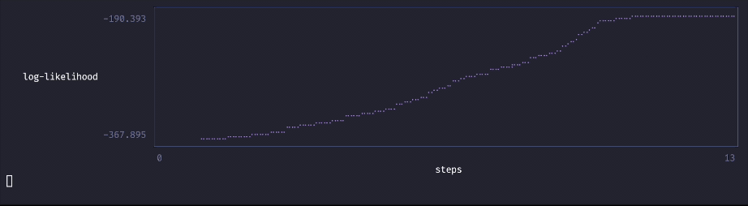
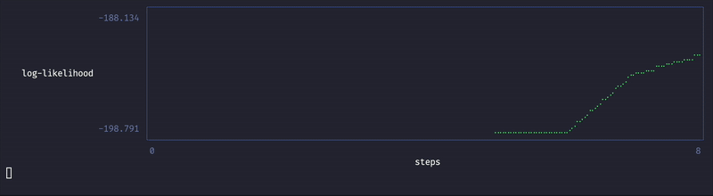

<!-- # ParsaBase -->

[](https://github.com/andrewsimpson4/ParsaModel.jl/actions/workflows/CI.yml?query=branch%3Amain)

<p align="center">


ParaModel is a domain-specific modeling language inside Julia for creating, estimating and predicting, using categorical parsimonious models. A categorical parsimonious models is a generic framework for models of the form
```math
X_i | Z = \gamma \sim F(T^i_{1}(\gamma), \dots, T^i_{G}(\gamma); \Psi)
```
where $Z_{mj} \sim \text{Categorical}(\pi_{m1}, \pi_{m2}, \dots, \pi_{mK_m})$. The package used macros for a simple way to allow one to define a large class of different models for model-based clustering, classification, and general patter recognition problems.

For a quick intuition on what this package does, ParsaModel is to model-based clustering and discriminant analysis as [STAN](https://en.wikipedia.org/wiki/Stan_(software)) and [JAGS](https://en.wikipedia.org/wiki/Just_another_Gibbs_sampler) is to bayesian inference.

---
 ⚠️ This package assumes a moderate understanding and discriminant analysis and mixture models. Checkout this [book](https://math.univ-cotedazur.fr/~cbouveyr/MBCbook/) on Model-Based Clustering and Classification for more information on this class of models.

⚠️ This package is currently under development and may be unstable. It is suggested to be used with caution at this time.

---

## 📋 Table of Contents

- [Features](#features)
- [Installation](#installation)
- [Quick Start](#quick-start)
- [Usage Tutorial](#usage-examples)
- [License](#license)

<div id='features'/>

## ✨ Features

- **Develop**: define custom and novel categorical parsimonious models
- **Fit models**: maximum likelihood estimation is used to fit models
- **Clustering, Predictions, and Likelihood**: Given your problem, the fitted model can be used to cluster observations, predict new observations, or get likelihoods

<div id='installation'/>

## 🚀 Installation

<!-- ```
] add ParsaBase
``` -->
<!--
```
] add https://<token>@github.com/andrewsimpson4/ParsaBase.jl.git
``` -->

If you are reading this, the repository is currently private. Use the following code to install.
#### Julia

```julia
using Pkg
Pkg.add(url="https://github.com/andrewsimpson4/ParsaModel.jl.git")
```

#### R

For use in R it is currently recommended to use the [JuliaCall](https://cran.r-project.org/web/packages/JuliaCall/index.html) package within R.

```r
install.packages("JuliaCall")
library(JuliaCall)
julia_setup(installJulia = TRUE)
julia <- julia_setup()

julia_command("using Pkg;")
julia_command('Pkg.add(url="https://<token>@github.com/andrewsimpson4/ParsaBase.jl.git")')

```
At this point the code below can be called using `julia_command` and `julia_assign`.

<div id='quick-start'/>

## 🏁 Quick Start

This is a minimal example of how to define and fit a $p$-dimensional Gaussian mixture model with $K$ components where observations are stored in the variable $X$.


#### Julia
```julia
model = ParsaBase(F=MtvNormal(p));
@|( model,
    Z = Categorical(K),
    X[i=1:n] ~ F(:mu => Z[i], :cov => Z[i]))
EM!(model; n_init=10, n_wild=10)
```
- Observations to be clustered are stores in `X` which is a vector where the elements are of type `Observation`
---

<div id='usage-examples'/>

## 💡 Usage Tutorial

For the examples listed below, $16$ different categorical parsimonious models are defined and fit all on the iris dataset. It should be noted most of this models are not actually good models for the iris dataset but are none the less possible to fit for the sake of simplicity.

For this example, the packages `CSV`, `DataFrames`, `Clustering`, `Distances`, `LinearAlgebra`, and `StatsBase` are required.

### Setup the iris dataset

Download the [iris](./examples/datasets/Iris.csv) dataset.

First the iris dataset is processed into the correct format for the package.
```julia
using CSV, DataFrames, Clustering, Distances, LinearAlgebra, StatsBase

iris = CSV.read("path/to/iris/dataset", DataFrame)
iris_matrix = Matrix(iris[:, 2:5])
iris_m = Observation.(eachrow(iris_matrix));
n=length(iris_m);
p=length(iris[1, 2:5]);
class_string = vec(iris[:,6]);
mapping = Dict(val => i for (i, val) in enumerate(unique(class_string)));
class = [mapping[val] for val in class_string];
```
Here we have a vector of vectors `iris_m` where each element is one of the observations from the dataset. Next is `class` which is a vector containing the species of the respective elements in `iris_m`. We also define `n`, the number of observations, as well as `p` which is the dimension of each observation. Note that each observation is of the type `Observation`.

### ParsaModel Macro

Since ParsaModel is a domain-specific modeling language inside Julia, it used a macro to allow a customized notation. The general macro notation for ParsaModel is `@| <model> <expressions>` or `@|(<model>, <expression1>, <expression2>,...)`. A large set of examples are given for the different `<expressions>` that can be used.

### Gaussian Mixture Model

The first example is how to implement a Gaussian mixture model using ParsaModel. In particular we are looking at the model $X_i | Z_i = k \sim N(\mu_k, \Sigma_k)$. This package is manly interacted with via macros which allows for a custom and minimal syntax. Here we are using a finite mixture model to cluster the observations in the iris dataset with the goal of clustering and recovering species. Thus we will look look for $3$ clusters.

```julia
K = 3
model = ParsaBase(F=MtvNormal(p));
@| model Z = Categorical(K) iris_m[i=1:n] ~ F(:mu => Z[i], :cov => Z[i])
EM!(model; n_init=10, n_wild=10)
```
The following is a description of what each function above is doing.
- The macro `@|` starts the notation and is followed by first the model we are building, in this case `model`, and then is followed by commands to build the model.
- `MtvNormal(p)` defines the base distributional assumption we are making for the data. In this case, a $p$-dimensional multivariate normal distribution.
- `ParsaBase` returns an isolated "space" where we will build the rest of the model.
- `Z = Categorical(K)` creates a new categorical distribution named `Z` with `K` categories inside of our space `model`.
- `iris_m[i=1:n] ~ F(:mu => Z[i], :cov => Z[i])` loops through `i` from $1$ to `n` and assigns `iris_m[i]` inside of `model` with the mapping `(:mu => Z[i], :cov => Z[i])`. The parameters `:mu` and `:cov` are exposed by `MtvNormal` and different base models will have different associated parameters. `Z[i]` represents a random variable sampled from `Z` which can take on values from $1$ to `K`.
- `EM!(model; n_init=100, n_wild=30)` simply fits the model! `n_init` is the number of initializations to run and `n_wild` is the number of steps per initializations run.

⚠️ This package currently uses random initialization by default. This can have mixed results for finding the maximum likelihood estimates but allows for package to fit ANY model which can be defined using the package. Just proceed with caution and watch the likelihood plot output for incite.

After running `EM!(model; n_init=100, n_wild=30)` you should see sometime like the following with your terminal.

Note: A alternate mathematical notation for the model that may better align with the syntax of the package may be $X_i | Z[i] \sim N(\mu(Z[i]), \Sigma(Z[i]))$.



The purple lines here are each of the initialization runs and the final green line is taking the best initialization and running the algorithm until convergence is reached.

Now that the model has been fit, we can look at the parameter estimates of the model. Since we used `MtvNormal` as the base, we have parameters for `:mu` and `:cov`. This can be viewed with the following.

```julia
@| model :mu :cov Z
```

Notice here that we have $3$ `:mu` parameters and $3$ `:cov` paramters since we fit a $3$ component mixture model. We also can see the estimated proportions of the categorical distribution `Z`. It should ne noted that the values returned for `:cov` are the lower cholesky decomposition of the symmetric matrix.

Since our goal was to use a gaussian mixture model to cluster observations from the iris dataset, we need to get the max posterior probability for each `Z[i]`. This can be done by the following.

```julia
id_ = [(@| model f(Z[i=j]))().max[1] for j in 1:n];
randindex(id_, class)
```
- `(@| model f(Z[i=j]))()` returns the $P(Z[i] = k | X)$ for $k=1,2,\dots, K$ since our categorical distribution `Z` has `K` categories.
- `.max` simply gets the max of $P(Z[i] = k | X)$ for $k=1,2,\dots, K$
- `randindex` is from the `Clustering` package and gives values such as the adjusted rand index to see how well the clustering solution compared to the ground truth.

<!--
One common task in mixture modeling is to calculate the bayesian information criterion of the model. This can be done with
```
@BIC(model)
``` -->


#### Custom Initialization

While the default initialization method is extremely flexible and works with any model which can be defined with this package, it may take a lot of initialization runs to achieve the desired performance. In cases when a custom initialization method can be defined for a given model structure, initial values can be passed directly into the model.

For the iris dataset with a Gaussian mixture model we will used hierarchical clustering found in the `Clustering` package to get initial ID's for each `Z[i]`.

```julia
iris_hclust = hclust(pairwise(Euclidean(), iris_matrix'), :ward)
init_id = cutree(iris_hclust, k=3)
```
We can now build and run the model which is the same as above with a few small changes.

```julia
model = ParsaBase(F=MtvNormal(p));
@|(model,
    Z = Categorical(K),
    Z[i=1:n] = init_id[i],
    iris_m[i=1:n] ~ F(:mu => Z[i], :cov => Z[i]))
EM!(model)

id_ = [(@| model f(Z[i=j]))().max[1] for j in 1:n];
randindex(id_, class)
```
- `Z[i=1:n] = init_id[i]` takes our initial values from init_id and assigns them to the respective random variable `Z[i]` for the first step of the EM algorithm.

You should see and output the following which shows very good clustering performance


```
(0.9038742317748124, 0.9574944071588367, 0.042505592841163314, 0.9149888143176734)
```
Notice here there are no purple lines since we did pre-initialize the algorithm.

### Parsimonious Gaussian Mixture Models

A common method in finite mixture models is to consider the parsimonious parameterization of the multivariate normal distribution. In particular we are considering the parameterization $N(\mu, a V\Lambda V')$. This is implemented in `R` using the very well known package `mclust`. We can do a similar thing in this package but because of the generalization of the method, we have the ability to implement far more models than existing packages. In the previous parameterization using the `MtvNormal` function we had access to two parameters. With this parameterization we have four.

#### Shared eigenvectors between components
Suppose we wish to fit a finite mixture model like before except where every component has the same eigenvector structure. This is implemented with the following.
```julia
K = 3
model = ParsaBase(F=ParsimoniousNormal(p));
@|( model,
    Z = Categorical(K),
    iris_m[i=1:n] ~ F(:mu => Z[i],
                      :a => Z[i],
                      :L => Z[i],
                      :V => 1))
EM!(model; n_init=20, n_wild=30)

id_ = [(@| model f(Z[i=j]))().max[1] for j in 1:n];
randindex(id_, class)
```
- `ParsimoniousNormal` gives the Parsimonious Gaussian parameterization as the base distributional assumption.
- `:V => 1` enforces that every component from the mixture has the same $V_1$ parameter.

#### Diagonal covariance matrices
Suppose we wish to enforce that each covariance matrix is diagonal in the mixture.

```julia
model = ParsaBase(F = ParsimoniousNormal(p));
const_V = [diagm(ones(4))];
@|( model,
    Z = Categorical(K),
    iris_m[i=1:n] ~ F(:mu => Z[i],
                      :a => Z[i],
                      :L => Z[i],
                      :V => 1),
    :V[i=1] == const_V[i]
)
EM!(model; n_init=20, n_wild=30)
@| model :V

id_ = [(@| model f(Z[i=j]))().max[1] for j in 1:n];
randindex(id_, class)
```
- `const_V = [diagm(ones(4))];` simply defined a diagonal matrix.
- `:V[i=1] == const_V[i]` sets $V_1$ as a constant and to be the diagonal matrix. Notice the `==` and not `=`. The double makes the change permanent i.e. a constant and a single `=` will make it so that parameter is only is that value for the first step of the EM algorithm.

#### Diagonal covariance matrices with shared eigenvalues

We can extend this further to a model where we assume diagonal covariance matrices and assume that each covariance matrix has the same eigenvalues.

```julia
model = ParsaBase(F = ParsimoniousNormal(p));
const_V = [diagm(ones(4))];
@|( model,
    Z = Categorical(K),
    iris_m[i=1:n] ~ F(:mu => Z[i],
                      :a => Z[i],
                      :L => 1,
                      :V => 1),
    :V[i=1] == const_V[i])
EM!(model; n_init=20, n_wild=30)
@| model :V :L

id_ = [(@| model f(Z[i=j]))().max[1] for j in 1:n];
randindex(id_, class)
```
One should now start to see a pattern of how simply changing the mapping for each observation leads to different models. This can be used to recreate the others parsimonious model structures in [Mclust](https://cran.r-project.org/web/packages/mclust/index.html) including others.


### Discriminant Analysis

So far we have considered using categorical parsimonious models for clustering, but we can also use then to build classifiers. We will again consider the iris dataset but now assume we know the classes (species) and wish to build a model to predict the species of new observations.

#### Linear Discriminant Analysis

To implement LDA using this package, it will look similar to a mixture model but now we instead know the true labels.

```julia
K = 3
model = ParsaBase(F = MtvNormal(p));
@|( model,
    class = Categorical(K),
    class[i=1:n] == class[i],
    iris_m[i=1:n] ~ F(:mu => class[i], :cov => 1))
EM!(model; n_init=1, n_wild=1)
```
- `class[i=1:n] == class[i]` simply assigns the value of `class[i]` to the respective random variable `class[i]` within our space `model` and changes it to a known variable. Thus `class[i]` can no longer take the values $1,2,\dots, K$ and instead is always the value of `class[i]`. Notice how we are now using `==` and not `=`.

Note here that there are no unknown categorical variables, thus EM algorithm is constant and we don't see and increase in the likelihood like before.

What if we wish to predict new observations? This can be done the following way

```julia
new_obs = Dict([(i+n) => Observation(x.X) for (i,x) in enumerate(iris_m)])
@| model new_obs[i=((1:n) .+ n)] ~ F(:mu => class[i], :cov => 1)
id_ = [(@| model f(class[i=j]))().max[1] for j in (1:n).+n];
mean(id_ .== class)
```
- `(1:n) .+ n` ensures that our new observation does not overlap i.e. share a random variable with observation defined for model training. If we have `class[i]`, that multiple observations would share the random variable `class[i]` which is not desired in this case.

#### Quadratic Discriminant Analysis

For QDA we simply have

```julia
K = 3
model = ParsaBase(F = MtvNormal(p));
@|( model,
    class = Categorical(K),
    class[i=1:n] == class[i],
    iris_m[i=1:n] ~ F(:mu => class[i], :cov => class[i]))
EM!(model; n_init=1, n_wild=1)

new_obs = Dict([(i+n) => Observation(x.X) for (i,x) in enumerate(iris_m)])
@| model new_obs[i=((1:n) .+ n)] ~ F(:mu => class[i], :cov => class[i])
id_ = [(@| model f(class[i=j]))().max[1] for j in (1:n).+n];
mean(id_ .== class)
```
#### Common component discriminant analysis

Suppose we wish to do a model like LDA and QDA but where each component shares the same covariance matrix. This can be done as follows.

```julia
model = ParsaBase(F = ParsimoniousNormal(p));
const_V = [diagm(ones(4))];
@|( model,
    class = Categorical(K),
    class[i=1:n] == class[i],
    iris_m[i=1:n] ~ F(:mu => class[i],
                      :a => class[i],
                      :L => class[i],
                      :V => 1),
    :V[i=1]=const_V[i])
EM!(model; n_init=1, n_wild=1)

new_obs = Dict([(i+n) => Observation(x.X) for (i,x) in enumerate(iris_m)])
@| model new_obs[i=((1:n) .+ n)] ~ F(:mu => class[i], :a => class[i], :L => class[i], :V => 1)
id_ = [(@| model f(class[i=j]))().max[1] for j in (1:n).+n];
mean(id_ .== class)
```

### Mixture discriminant analysis

Suppose we wish to assume that each class follows Gaussian mixture model. This can be done by

```julia
K = 3
model = ParsaBase(F = MtvNormal(p));
@|( model,
    class = Categorical(K),
    class[i=1:n] == class[i],
    Z = Categorical([1=>2,2=>2,3=>2]),
    iris_m[i=1:n] ~ F(:mu => [class[i], Z[class[i]][i]], :cov => [class[i], Z[class[i]][i]]))
EM!(model; n_init=1, n_wild=1)
@| model :mu

new_obs = Dict([(i+n) => Observation(x.X) for (i,x) in enumerate(iris_m)])
@| model new_obs[i=((1:n) .+ n)] ~ F(:mu => [class[i], Z[class[i]][i]], :cov => [class[i], Z[class[i]][i]])
id_ = [(@| model f(class[i=j]))().max[1] for j in (1:n).+n];
mean(id_ .== class)
```
- `Z = Categorical([1=>2,2=>2,3=>2])` creates a set of three categorical distributions each which has two categories. These categorical distributions are indexed by `1,2, and 3` respectively. This is to set up a different categorical distribution for each class.
- `[class[i], Z[class[i]][i]]` ensures that our parameters are index by two variables. The first indicates the class and the second indicates the component of the mixture model within that class.
- Note that `Z[class[i]]` returns the categorical distribution of class `class[i]` at which point `Z[class[i]][i]` gets the random variable of  categorical distribution `Z[class[i]]`
- Take note of the output from `@| model :mu`

Note that this is very similar to `MclustDA` in `R`.

#### Mixture discriminant analysis with shared eigenvectors within classes

To do the same except assume the covariance matrices for the components within each class share the same eigenvectors we can do the following

```julia
K = 3
model = ParsaBase(F = ParsimoniousNormal(p));
@|( model,
    class = Categorical(K),
    class[i=1:n] == class[i],
    Z = Categorical([1=>2,2=>2,3=>2]),
    iris_m[i=1:n] ~ F(:mu => [class[i], Z[class[i]][i]],
                                        :a => [class[i], Z[class[i]][i]],
                                        :L => [class[i], Z[class[i]][i]],
                                        :V => class[i]))
EM!(model; n_init=1, n_wild=1)

new_obs = Dict([(i+n) => Observation(x.X) for (i,x) in enumerate(iris_m)])
@| model new_obs[i=((1:n) .+ n)] ~ F(:mu => [class[i], Z[class[i]][i]],
                                        :a => [class[i], Z[class[i]][i]],
                                        :L => [class[i], Z[class[i]][i]],
                                        :V => class[i])
id_ = [(@| model f(class[i=j]))().max[1] for j in (1:n).+n];
mean(id_ .== class)
```

#### Mixture discriminant analysis with shared eigenvectors within classes

What is we wish to do the same but now assume there is a single set of eigenvectors shared between all components across all classes. This is done with

```julia
K = 3
model = ParsaBase(F = ParsimoniousNormal(p));
@|( model,
    class = Categorical(K),
    class[i=1:n] == class[i],
    Z = Categorical([1=>2,2=>2,3=>2]),
    iris_m[i=1:n] ~ F(:mu => [class[i], Z[class[i]][i]],
                                        :a => [class[i], Z[class[i]][i]],
                                        :L => [class[i], Z[class[i]][i]],
                                        :V => 1))
EM!(model; n_init=1, n_wild=1)

new_obs = Dict([(i+n) => Observation(x.X) for (i,x) in enumerate(iris_m)])
@| model new_obs[i=((1:n) .+ n)] ~ F(:mu => [class[i], Z[class[i]][i]],
                                        :a => [class[i], Z[class[i]][i]],
                                        :L => [class[i], Z[class[i]][i]],
                                        :V => 1)
id_ = [(@| model f(class[i=j]))().max[1] for j in (1:n).+n];
mean(id_ .== class)
```

#### Mixture discriminant analysis with two covariance matrices shared across between all components

This model is much more complicated but allows for a dramatic reduce is the number of parameters in the model. We again assume that each class follows a mixture model but now assume that each covariance matrix of each component is one of two possible covariance matrices

```julia
model = ParsaBase(F = MtvNormal(p));
@|( model,
    class = Categorical(K),
    class[i=1:n] == class[i],
    Z = Categorical([1=>2,2=>2,3=>2]),
    cov = Categorical(2),
    iris_m[i=1:n] ~ F(:mu => [class[i], Z[class[i]][i]], :cov => cov[class[i], Z[class[i]][i]]))
EM!(model; n_init=1, n_wild=1)
@| model, :cov
```
- Because of the nesting of multiple random variables via `cov[class[i], Z[class[i]][i]]`, many of the observations are dependent on each other. This creates a complex likelihood structures and leads to a slower algorithm as the computational expense has been increased.
- Take note of the output of `@| model, :cov` and the number of covariance parameters.

If we where to introduce a new random variable of unknown class and try to predict its class, because of the complex dependency structure, is it nearly computationally infeasible. To fix this, we can predict the most likely covariance matrix for each component and assign it to the respective component.

```julia
G = Dict([j => (@| model f(cov[i=[j]]))() for j in reduce(vcat, [[[i,j] for i in 1:K] for j in 1:2])]);
for (key, M) in G
    mm = Dict(key => M.max[1])
    @| model cov[i=[key]] == mm[i]
end
```

We have now avoided the computational complexity and can predict new observations.

```julia
new_obs = Dict([(i+n) => Observation(x.X) for (i,x) in enumerate(iris_m)])
@| model new_obs[i=((1:n) .+ n)] ~ F(:mu => [class[i], Z[class[i]][i]], :cov => [class[i], Z[class[i]][i]])
id_ = [(@| model f(class[i=j]))().max[1] for j in (1:n).+n];
mean(id_ .== class)
```

#### Mixture discriminant analysis with two covariance matrices shared across between all components and one set of eigenvectors shared across the two covariance matrices

We can now do something a little crazy and assume that the two covariance matrices within our model share the same eigenvectors.

```julia
K = 3
model = ParsaBase(F = ParsimoniousNormal(p));
@|( model,
    class = Categorical(K),
    class[i=1:n] == class[i],
    Z = Categorical([1=>2,2=>2,3=>2]),
    cov = Categorical(2),
    iris_m[i=1:n] ~ F(:mu => [class[i], Z[class[i]][i]],
                      :a => cov[class[i], Z[class[i]][i]],
                      :L => cov[class[i], Z[class[i]][i]],
                      :V => 1))
EM!(model; n_init=1, n_wild=1)
@| model :L :V
G = Dict([j => (@| model f(cov[i=[j]]))() for j in reduce(vcat, [[[i,j] for i in 1:K] for j in 1:2])]);
for (key, M) in G
    mm = Dict(key => M.max[1])
    @| model cov[i=[key]] == mm[i]
end
new_obs = Dict([(i+n) => Observation(x.X) for (i,x) in enumerate(iris_m)])
@| model new_obs[i=((1:n) .+ n)] ~ F(:mu => [class[i], Z[class[i]][i]],
                                     :a => cov[class[i], Z[class[i]][i]],
                                     :L => cov[class[i], Z[class[i]][i]],
                                     :V => 1)
id_ = [(@| model f(class[i=j]))().max[1] for j in (1:n).+n];
mean(id_ .== class)
```
- Note the outputs of `@| model :L :V` and the number of parameters estimated.

### Semi-Supervised Gaussian Mixture Models

Suppose for whatever reason we know the true species of some of the observations in the iris dataset. We will simulate this using the following where we assume we know the label of $30$ of the observations.

```julia
known_samples = sample(1:n, 30; replace=false)
known_map = Dict([s => class[s] for s in known_samples])
```

We can now run the model which is similar to before but with one additional line.
```julia
model = ParsaBase(F = MtvNormal(p));
@|( model,
    Z = Categorical(K),
    Z[i=known_samples] == known_map[i],
    iris_m[i=1:n] ~ F(:mu => Z[i], :cov => Z[i])
)
EM!(model; n_init=10, n_wild=10)

id_ = [(@| model f(Z[i=j]))().max[1] for j in 1:n];
randindex(id_, class)
```
- `Z[i=known_samples] == known_map[i]` simply assigns the value of `known_map[i]` to the respective random variable `Z[i]` and changes it to a known variable. Thus `Z[i]` can no longer take the values $1,2,\dots, K$ and instead is always the value of `known_map[i]`.

#### Semi-Supervised Gaussian Mixture Models with Positive Constraints

Assume we know every two observations in the iris dataset came from the same yet unknown component. This information can be incorporated as follows by first setting up some needed information.

```julia
blocks = Int.(repeat(1:(n/2),inner=2))
n_blocks = length(unique(blocks))
true_class_block = [class[i] for i in 1:n if i % 2 == 0]
```
We can now setup the model as follows
```julia
model = ParsaBase(F = MtvNormal(p));
@|( model,
    Z = Categorical(K),
    B = Categorical(n_blocks),
    B[i=1:n] == blocks[i],
    iris_m[i=1:n] ~ F(:mu => Z[B[i]], :cov => Z[B[i]])
)
EM!(model; n_init=10, n_wild=20)

id_ = [(@| model f(Z[i=j]))().max[1] for j in 1:n_blocks];
randindex(id_, true_class_block)
```

#### Semi-Supervised Gaussian Mixture Models with Negative Constraints

Suppose we know that the first two observations are from different components or species (this is not true but we will go with it). We can incorporate this into the model with negative constraints in the following way.

```julia
blocks = [1;1:(n-1)]
II = [1;2; repeat([1], 148)]
n_blocks = length(unique(blocks))
perms = reduce(vcat, [[[i,j] for i in 1:K if i != j] for j in 1:K])
model = ParsaBase(F = MtvNormal(p));
@|( model,
    B = Categorical(n_blocks),
    B[i=1:n] == blocks[i],
    P = Categorical([i => 3 for i in 1:6]),
    P[i=1:6][j=1:2] == perms[i][j],
    I = Categorical(2),
    I[i=1:n] == II[i],
    PP = Categorical(6),
    iris_m[i=1:n] ~ F(:mu => P[PP[B[i]]][I[i]], :cov => P[PP[B[i]]][I[i]])
    )
EM!(model; n_init=1, n_wild=1)
@| model :mu :cov
perms[(@| model f(PP[i=1]))().max[1]]
```
- The final line outputs the predicted species of the first and second observation in the iris dataset. Notice that they are not the same as was enforced.

### Fast posterior prediction and likelihood calculations

Consider the simple finite mixture model

```julia
K = 3
model = ParsaBase(F=MtvNormal(p));
@| model Z = Categorical(K) iris_m[i=1:n] ~ F(:mu => Z[i], :cov => Z[i])
EM!(model; n_init=10, n_wild=10)
```

In order to calculate the posterior probabilities we used the code

```julia
id_ = [(@| model f(Z[i=j]))().max[1] for j in 1:n];
```
While this works, it can be extremely slow as the likelihood must be recompiled for each `i`. To speed this up we do the following.

```julia
new_x = Dict(n+1 => Observation(zeros(p)));
ff = @| model  new_x[i=(n+1)] ~ F(:mu => Z[i], :cov => Z[i]) f(Z[i=(n+1)]);
id_ = [ (new_x[n+1].X = x.X; ff().max[1]) for x in iris_m];
randindex(id_, class)
```
- Here each observation in `iris_m` is of type `Observation` which has a variable `X` which is updated to a new value without have to recompile the Bayes decision rule which is stored in `ff`

We can do a similar thing for getting the likelihood of the model given an observation(s). This can be done with

```julia
new_x = Dict(n+1 => Observation(zeros(p)));
ff = @| model  new_x[i=(n+1)] ~ F(:mu => Z[i], :cov => Z[i]) f(new_x[i=(n+1)]);
likelihoods = [ (new_x[n+1].X = x.X; ff()) for x in iris_m]
```

### Adding a custom base density

Following the paper, one may wish to add a different base distribution $F$ other than the default normal distribution. To show how this this can be done, an example is given using a normal distribution.

#### General sketch and structure
The general sketch and structure of adding a new base density is as follows. First a function is defined which is the M-step for the parameter.

```julia
function parameter_M_step(value::Any, index_package::SummationPackage, logPdf::Function)
    # code for updating the parameter
    for (x, prop, params) in index_package
       # to access the values of x you must use val(x)
       # to access a parameter you must use val(params[:param1])
    end
end
```

- `value` is the parameter estimate from the previous step
- `index_package` of type `SummationPackage` is a zipped tuple each each element contains an Observations, a probability, and a set of parameters
- This structure is meant to match the notation found in the paper.

Next the pdf and log pdf are defined.

```julia
function pdf(X::Any, params::Dict)
    # pdf for the density
end

function logPdf(X::Any, params::Dict)
    # log pdf for the density
end

```

A function is defined which checks that the user inputs the correct data type.

```julia
input_check(x::Any;) = # checks if x is of the right type for the density

```

Finally a new `ParsaDensity` is defined with the following structure.

```julia
Distribution_name(;) = ParsaDensity(pdf, logPdf, input_check, :param1 => Parameter(init_value, parameter_M_step),
                                                              :param2 => Parameter(init_value_2, num_of_parameters, parameter_M_step_2))

```

- `Parameter` defines a new parameter with an initial value and a function which is the M-step for that function
- Note that an arbitrary number of parameters can be added in the same manure

After that is implemented simply do

```julia
model = ParsaBase(F=Distribution_name(;));
```

and start modeling!

#### MtvNormal example

For an example, the implementation for a multivariate normal distribution is given.

```julia
function normal_mean_update(value::Any, index_package::SummationPackage, log_pdf::Function)
    mu_new = zeros(length(value))
    cov = zeros(length(value), length(value))
    for (_, pr, params) in index_package
        cov += pr * val(params[:cov]).inv
    end
    for (x, pr, params) in index_package
        mu_new += pr * val(params[:cov]).inv * val(x)
    end
    mu_new = cov \ mu_new
    return mu_new
end

function normal_covariance_update(value::Any, index_package::SummationPackage, log_pdf::Function)
    cov_new = zeros(size(value.inv))
    for (x, pr, params) in index_package
        y = val(x) - val(params[:mu])
        cov_new += pr * (y * y')
    end
    taus = [d[2] for d in index_package]
    cov_new ./= sum(taus)
    return (inv = inv(cov_new), det = det(cov_new))
end

function normal_pdf(X::Any, params::Dict)
    p = length(X)
    y = (X - val(params[:mu]))
    (2pi)^(-p/2) * val(params[:cov]).det^(-1/2) * exp((-1/2 * y' * val(params[:cov]).inv * y))
end

function normal_pdf_log(X::Any, params::Dict)
    N = MvNormal(params[:mu], params[:cov])
    logpdf(N, X)
end

normal_input(x, p) = length(x) == p && all(isa.(x, Real))

MtvNormal(p) = ParsaDensity(normal_pdf, normal_pdf_log, (x) -> normal_input(x, p),
                                :mu => Parameter(zeros(p), normal_mean_update),
                                :cov => Parameter((inv = diagm(ones(p)), det = 1), p * (p + 1) / 2, normal_covariance_update))
```

---

<!-- <div id='api-reference'/>

## 📖 Package Reference -->

<!-- ### `ParsaBase(base)` -->

<!-- Setup the model and set the base distributional assumption of the model. -->

<!-- **Parameters:**

| Parameter | Type | Required | Description |
|-----------|------|----------|-------------|
| `base` | Parsa_Base | No | distributional assumption |

**Returns:**

Returns a Parsa_Module to build the model -->

<!-- ### `@Categorical(model, name, K)` -->

<!-- Creates a new categorical distribution inside of `model` with `K` categories with the name of `name`. -->

<!-- **Parameters:**

| Parameter | Type | Required | Description |
|-----------|------|----------|-------------|
| `model` | Parsa_Module | Yes | model space |
| `var`   | None | Yes | Name of the distribution|
| `K`     | Int  | Yes | Number of categories -->


<!-- ### `@Observation(model, X[i] = Y[i] -> (:par => ), i = N)` -->

<!-- Adds a new observations named `X` indexed by `i` with the value of `Y[i]` and the mapping `(:par => )`. This is repeated for each `i` in `N` -->

<!-- ### `@Known(model, name[i] = C[i], i = N)` -->
<!-- Sets the random variables `name[i]` to known with the value of `C[i]`. This is repeated for each `i` in `N`. -->

<!-- ### `@Initialize(model, name[i] = C[i], i = N)` -->
<!-- Sets the random variables `name[i]` to the value of `C[i]`. This is repeated for each `i` in `N`. -->

<!-- ### `@Constant(model, :par[i] = C[i], i = N)` -->
<!-- Sets the parameter `:par[i]` to be constant with the value of `C[i]`. This is repeated for each `i` in `N`. -->

<!-- ### `@Parameter(model, :par)` or `@Parameter(model, name)` -->
<!-- Returns either the parameters of `:par` or the probabilities of the categorical distribution `name`. -->

<!-- ### `EM!(model; n_init=1, n_wild=1, should_initialize=true, verbose=true)` -->
<!-- Fits the model by running the EM algorithm and finding parameter estimates. -->

<!-- ### `@posterior_probability(model, [var1, var2, ...], i=N)` -->
<!-- Returns a function that returns the posterior probabilities of `[var1, var2, ...]` for each `i` in `N`. -->

<!-- ### `@BIC(model)`
Returns the bayesian information criterion of the model.

### `@likelihood(model, X[i], i = N)`
Returns a function that returns the likelihood $f(X[N_1], X[N_2], \dots, X[N_m])$.


### `@ObservationUpdater(model, X[i], i=N)`
Returns a function that takes in `$|N|$` observations and will assign them to the corresponding `X[i]`.

### `MtvNormal(p)`
Returns the base for a `p`-dimensional Gaussian distribution.

### `ParsimoniousNormal(p)`
Returns the base for a `p`-dimensional Gaussian distribution with the parsimonious parameterization. -->

---
<!-- **Parameters:**

| Parameter | Type | Required | Description |
|-----------|------|----------|-------------|
| `model` | Parsa_Module | Yes | model space |
| `var`   | None | Yes | Name of the distribution|
| `K`     | Int  | Yes | Number of categories -->

<div id='license'/>

## 📄 License

This project is licensed under the MIT License - see the [LICENSE](LICENSE) file for details.
